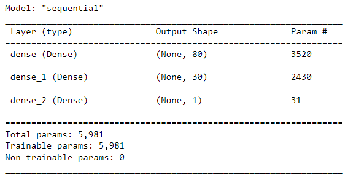
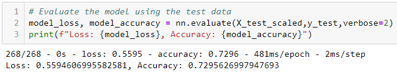
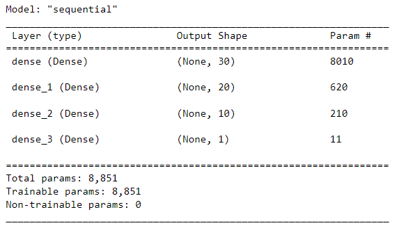
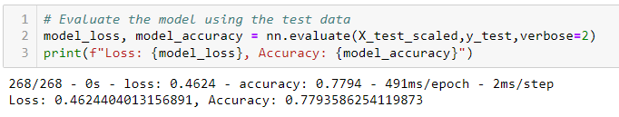

# deep-learning-challenge
# Alphabet Soup Charity Neural Network Model Report

## Overview

The purpose of this analysis is to create a binary classifier model that can help the Alphabet Soup's nonprofit foundation select applicants for funding with the best chance of success in their ventures. Ideally, this model should have an accuracy score greater than 75%.

## Results

### Data Preprocessing
Originally, the data had 44 columns. Two columns were removed (i.e. "EIN" and "NAME") because they did not appear to have a relevance to the model performance. The remaining columns made up our features. The target variable for our model is the "IS_SUCCESSFUL" column.

### Compiling, Training, and Evaluating the Model
Initially, I selected a model with two layers. The first layer had 80 neurons, which is a good starting point considering the data had over 40 features. The second layer had 30 neurons. It was appropriate to have a second layer that would re-weight inputs from the first layer. I used the relu activation function for these layers. Since this is a classification model, I used the sigmoid activation function for the output layer.

The model's results yielded an accuracy rate of 73% as per the image below.

### Optimization 
In an attempt to increase the model's performance, I created a second model wherein I added back the "NAME" column onto the features. I also added an additional hidden layer so as to give the model another opportunity to re-weight its inputs. Instead of having 80 neurons for first layer, I reduced the neurons to 30. The second and third layers had 20 and 10 neurons respectively (I tried to keep the average number of neurons per layer at 20 which is the midpoint of 40 features). Additionally, for the second layer, I used the tanh activation function instead of the relu activation function.

The model's results yielded an accuracy rate of 77.9%.

## Summary

It appears that the inputs of our dataset had a great impact on the model's accuracy. This is because adding back the "NAME" column onto our model was critical in achieving our 75% accuracy rate. Our machine learning model can now show moderate success (with an accuracy over 75%) in predicting whether an applicant will be successful if given a loan by Alphabet Soup. Ultimately, the shape of our dataset prior to preprocessing has a great impact on our model's output.

If I had more resources than just my local computer, I could probably have created a function that automated the optimization process by using the kerastuner library. This would have probably picked the best model parameters and even achieved a much higher accuracy score.

